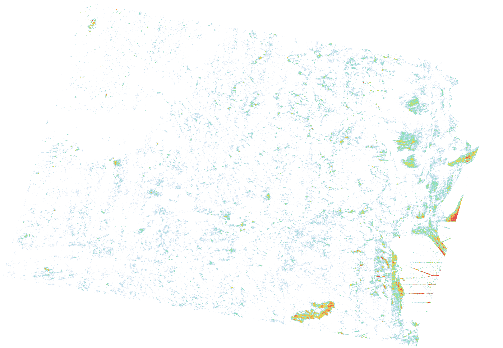
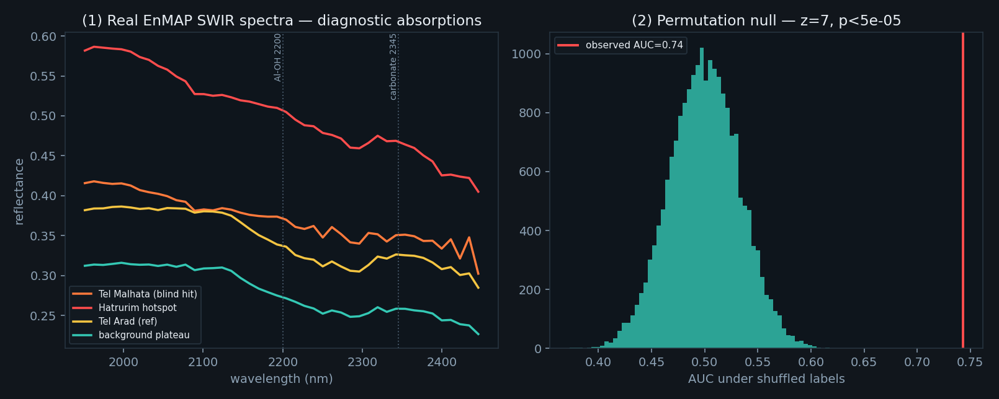

# SherdHunter

**Finding ancient pottery-scatter sites from public hyperspectral satellite data.**

SherdHunter is an open, reproducible pipeline + dashboard that screens arid landscapes for the
faint spectral signature of **fired ceramics and human-altered (anthrosol) surfaces** at
archaeological tells — using free satellite hyperspectral imagery (NASA **EMIT**, DLR **EnMAP**).

> **Honest scope first:** at 30–60 m per pixel we do **not** see individual sherds. We detect the
> *integrated, sub-pixel chemical shadow* of a human-altered surface — a **statistical anomaly
> screen**, not a sherd map. It tells you *where to look*; confirmation needs drones, fieldwork
> and lab work. Everything below is reported with that in mind, including the false alarms.

🎬 **`sherdhunter_full.mp4`** in this repo is a ~2-minute explainer (animated intro → live
dashboard walkthrough → credits).

---

## The idea (physics)

- Clay minerals show a diagnostic **Al–OH absorption near 2200 nm**. Firing clay above ~550 °C
  dehydroxylates it — the feature degrades. **Fired material is spectrally separable from raw clay.**
- Northern-Negev terrain is carbonate; ash / lime-plaster can **deepen the 2345 nm calcite**
  feature on a tell (an anthrosol signal).
- So we build two **direction-locked** screens (no per-scene training):
  - **firing screen** = (−Al-OH 2200 depth) + brightness — the *specific* archaeological marker;
  - **carbonate-halo screen** = +calcite 2345 depth — broad anthrosol / terrain context.
  Each is turned into a **local anomaly** (scene minus a ~5 km median background).

## Does it work? (validation, EnMAP 30 m over Tel Arad / the Dead Sea)

- **Known archaeological sites — never used to build the detector — separate from random terrain at
  AUC ≈ 0.78** (firing screen). A **permutation null test** (20,000 label shuffles) puts the
  observed AUC at **z ≈ 7, p < 5×10⁻⁵** — not chance.
- **Blind test:** *Tel Malhata* (a held-out Negev tell with known sherd scatter) lands near the top.
- **Spectral sanity check:** at real hot spots the carbonate and Al-OH absorptions behave exactly as
  the physics predicts (see `viewer/verify.png`).
- **Following the false alarms (this is the point):** the brightest raw hot spots were **not** ruins —
  they were the **Hatrurim Formation** (natural in-situ-combusted "Mottled Zone" carbonate) and the
  **Dead Sea** salt flats. We mapped them (GSI geology + an OSM water/salt/urban mask) and removed
  them, leaving a short, clean candidate list.

We also pre-registered and ran a **MESMA sub-pixel unmixing** detector — and report honestly that it
**did not beat** the simple firing screen (AUC 0.71 < 0.78). The simple physics feature wins here.




## Run the dashboard

No build step — it's a static page that reads the JSON/GeoJSON results in `viewer/`.

```bash
cd sherd-hunter
python -m http.server 8753 --directory viewer
# open http://localhost:8753
```

On Windows you can double-click **`open-dashboard.bat`** (starts the server + opens the browser).
In the dashboard, click the **Guide** button for an interactive tour, or append **`#demo`** to the
URL for a self-running walkthrough.

## Reproduce the analysis

Large satellite cubes are **not** committed (multi-GB, and reproducible from granule IDs — see
`SOURCES.md`). With a free NASA Earthdata token (EMIT) or a DLR EnMAP scene:

```bash
pip install numpy rasterio netCDF4 shapely pillow requests scipy

python pipeline/fetch_known_sites.py      # OSM known sites + masks  -> viewer/known_sites.geojson
python pipeline/fetch_geology.py          # GSI 1:200k geology       -> viewer/geology.geojson
python pipeline/fetch_nosherd_mask.py     # water/salt/urban mask    -> viewer/nosherd_mask.geojson
python pipeline/composite_enmap.py        # the two-screen detector on an EnMAP scene
python pipeline/verify.py                 # permutation null + spectral sanity
```

`pipeline/` also has: `detect.py` (EMIT ACE + destriping), `roc_analysis.py` (matched-terrain ROC),
`mesma_enmap.py` (the unmixing comparison), `make_video.py` / `make_walkthrough.py` / `make_final.py`
(the explainer video), and `enmap_fetch.py` / `prisma_fetch.py` (data readers).

## Repository layout

```
viewer/        self-contained Leaflet dashboard + the result JSON/GeoJSON/PNG it reads
pipeline/      all the Python (detection, knowledge layers, validation, video)
sherd_hunter.py, detect.py …   core spectral routines
SOURCES.md     open-data catalogue + access notes
```

## Data sources & credits

Built entirely on open data — please respect each provider's terms (see `SOURCES.md`):
**NASA JPL (EMIT)** · **DLR (EnMAP)** · **Geological Survey of Israel** (1:200k geology) ·
**OpenStreetMap** contributors (sites + masks) · **USGS** splib07 spectral library · basemaps © Esri / Google.

## Limitations

- Statistical screening at 30–60 m, **not** sherd detection. Expect false positives.
- Demonstrated mainly on a single arid (Negev / Dead Sea) EnMAP scene; multi-scene / multi-sensor /
  multi-season work is future. Carbonate is ubiquitous in the Negev, so the **firing (Al-OH) signal
  is the more specific marker**; the carbonate channel is more of a terrain indicator.
- Geology / no-sherd masks currently cover **Israel only** (no Jordan).

## Contributing

Issues and PRs welcome — better endmembers, more scenes/regions, a proper geology mask beyond Israel,
PRISMA support, multi-temporal stacking, or moving toward the drone/field confirmation tier.

## License

Code: **MIT** (see `LICENSE`). Data: each provider's own terms (see `SOURCES.md`).
